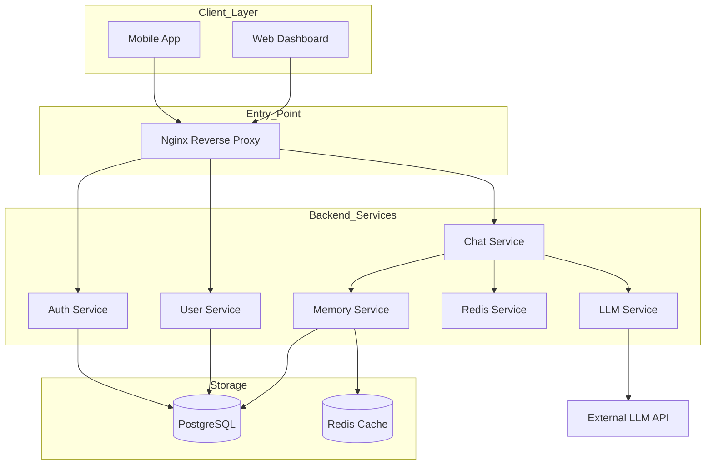

# How CureLink Works: Our Backend Design

At its heart, CureLink is built to handle sensitive healthcare conversations in real-time. We've designed a backend that's fast enough to feel like a natural chat, but robust enough to keep every piece of medical information safe and consistent.

## 1. The Big Picture
We use a service-oriented structure. This means instead of one giant block of code, we have specialized services that talk to each other. This keeps the performance snappy and makes it much easier for us to fix or upgrade specific parts of the app without breaking everything else.

### Our Structural Map

## 2. Who Does What?
We’ve split the work among several specialized "workers" (services):

*   **Auth Service**: Our "Security Guard." It handles logins and makes sure everyone connecting is who they say they are by using secure JWT tokens.
*   **User Service**: The "Librarian" for profiles. It knows everything about a user’s medical background—their allergies, medications, and general history.
*   **Chat Service**: The "Conductor." It manages the active WebSocket connection and makes sure messages flow smoothly between the user and our AI.
*   **Memory Service**: The "Short-term Memory." It fetches your last few messages from our main database (PostgreSQL) and puts them in a speed-optimized cache (Redis) so the AI never forgets what you just said.
*   **Redis Service**: A specialized tool used by the Conductors to store data instantly without waiting on the slow main database.
*   **LLM Service**: The "Brain." It takes all the raw info—your message, your history, and your medical profile—and packages it into a prompt that makes sense for the AI (GPT/Claude) to answer safely.

---

## 3. The Lifecycle of a Message
To understand how data moves, let’s follow two common paths:

### Signing In & Setting Up (REST)
When you log in or change your profile, it’s a standard request. The **Auth Service** double-checks your credentials against our **PostgreSQL** database, gives you a secure "pass" (JWT), and the **User Service** saves your details. It’s a clean, straightforward transaction.

### Having a Conversation (WebSockets)
This is where the magic happens. 
1.  **The Handshake**: You open the app and connect to our WebSocket. We instantly look up who you are and load your last few messages into **Redis** so the AI has context.
2.  **The Message**: You type a question. 
3.  **The AI's Prep**: The **Chat Service** asks the **User Service** for your medical context and the **Memory Service** for the recent chat flow. 
4.  **The Response**: The **LLM Service** talks to the AI and gets an answer. 
5.  **Saving Everything**: We don't just send you the answer; we save it to **PostgreSQL** forever and update your **Redis** cache so the *next* message feels just as connected.

---

## 4. Our Tech Choices
We didn't pick these tools by accident:
*   **FastAPI**: Because healthcare data shouldn't be slow. It handles many connections at once using "Async" technology.
*   **PostgreSQL**: Our "Source of Truth." It's where your data is stored permanently and safely.
*   **Redis**: Our "Super-speed Cache." It makes the chat feel instant by keeping current talk "on top of the desk" rather than locked in a filing cabinet.
*   **Docker & Nginx**: These keep our app in a clean, predictable environment that's easy to deploy and scale.

---

## 5. Where We're Heading
As CureLink grows from hundreds to thousands of conversations, we have a clear roadmap:

### Offloading the Heavy Lifting
Right now, the server does a lot of work at once. In the future, we'll use **Message Queues (like RabbitMQ or Kafka)**. This means when a message comes in, we can immediately reply to the user and let a separate "Worker" handle the background task of updating summaries. This keeps the chat lightning-fast.

### Moving to Micro-Intelligence
We want to move from "Summaries" to "Deep Knowledge." Instead of just summarizing the chat, we'll use **Vector Databases** (like PgVector). This lets the AI "search" through your entire medical history in milliseconds to find one specific detail you mentioned six months ago.

### Decoupling for Scale
We’ll eventually pull the **LLM Service** and **Memory Service** into their own independent mini-servers. This way, if we have a lot of chat traffic, we can just add more "Brain" servers without having to touch the rest of the app.

We’re building this to be more than just a chat—we’re building a long-term medical assistant that gets smarter and faster every day.