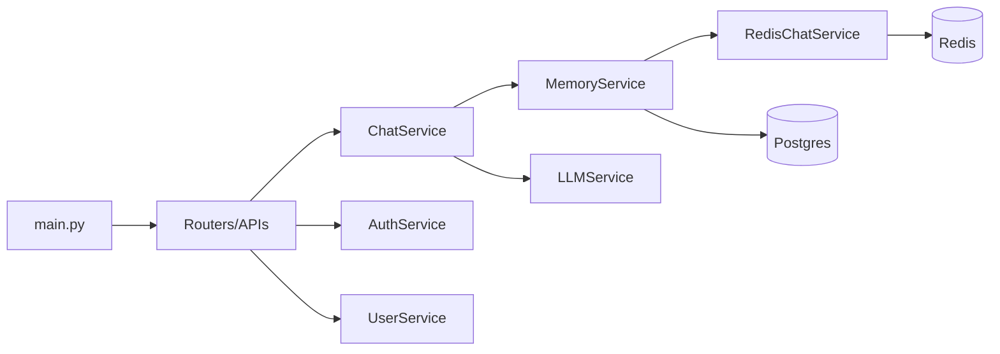

# Inside CureLink: The Low-Level Design (LLD)

If the HLD is our high-altitude view, this document is the zoomed-in map. We’re looking at the actual gears, the wires, and the specific rules that make CureLink tick. Think of this as the manual for how our code is physically built.

---

## 1. The Interaction Map: Who Talks to Whom?
We’ve built this system so that information flows in a very specific, logical order. Components only talk to what they absolutely need to, which keeps our code tidy and prevents "spaghetti code" from making future updates difficult.

---

## 2. Our Folder Logic: Finding Your Way Around
We organize our codebase so that every file has a designated spot. This ensures that any developer can walk in and know exactly where the database logic ends and the AI logic begins.

*   **`app/apis/v1/`**: This is where we define our endpoints. If the frontend needs to fetch data or send a message, it happens here.
*   **`app/core/`**: All our global rules—like security keys, logging formats, and error handling—live here.
*   **`app/database/`**: This section handles the work of connecting to Postgres and managing database sessions safely across the app.
*   **`app/models/`**: These files define exactly what our data looks like when it's stored in the database.
*   **`app/services/`**: These are the logic centers. If there’s actual thinking, calculating, or data processing to do, it happens in one of these classes.
*   **`alembic/`**: We use this to track every change we make to our database structure, allowing us to migrate or roll back safely.

---

## 3. The Data Vault: What We Store
We use a relational database (Postgres) for permanent medical history and a fast cache (Redis) for the active conversation.

### 3.1. Authentication Data (`auth_users`)
This is kept minimal. We only store your email and a unique ID. We purposely separate login credentials from medical data to improve security and privacy.

### 3.2. Medical Profiles (`user_onboarding`)
This is the heart of the health assistant. We use the **JSONB** format for things like medications and allergies, which lets these lists grow or shrink naturally without adding unnecessary complexity to the database.

### 3.3. Chat History (`chat_messages`)
Every message is saved with its role (user or AI) and a timestamp. We use an auto-incrementing ID to ensure we can always reconstruct the conversation in its exact chronological order.

### 3.4. Clinical Summaries (`user_summary`)
To save the AI from re-reading every old message, we store a condensed medical summary. It acts as a reference for the AI to quickly recall chronic conditions or recent changes.

---

## 4. Service Breakdown

### 4.1. AuthService
This service manages security and identity. It handles the login process and issues secure JWT tokens. Once a user has this token, the other services can trust their identity.

### 4.2. UserService
This service manages health profiles. It ensures that when a user updates their medical background, the data is saved correctly and is immediately available for the AI to use during a conversation.

### 4.3. ChatService
This is the primary orchestrator for the chat. When a user sends a message, this service ensures that the user's input is saved, the AI's response is generated, and then the response is also saved. We use a single transaction for this to make sure the chat history stays perfectly in sync.

### 4.4. MemoryService
This service manages the transition between long-term and short-term memory. It "hydrates" the fast Redis cache with recent history when a user connects and triggers background tasks to refresh the medical summary every few messages.

### 4.5. LLMService
This service handles all communication with the AI. It builds the specialized "Disha" persona—ensuring the AI's tone is clinical and safe—and handles the logic for creating medical summaries.

### 4.6. RedisChatService
This handles the low-level interactions with Redis. We use "Time-to-Live" (TTL) rules here to ensure that session data is automatically cleaned up after the chat ends, keeping our memory usage efficient.

---

## 5. Staying Safe: Errors and Logs
We've designed the system to be transparent about what's happening under the hood. 
*   **Standard Errors**: We use a custom `AppException` so that no matter what goes wrong, the user gets a clean, helpful message instead of a generic server crash.
*   **Consistent Logging**: Every major event—like a login or an AI reply—is logged using clear, detailed f-strings. This allows us to look at the server logs and understand the "story" of any user's session if we need to troubleshoot.
